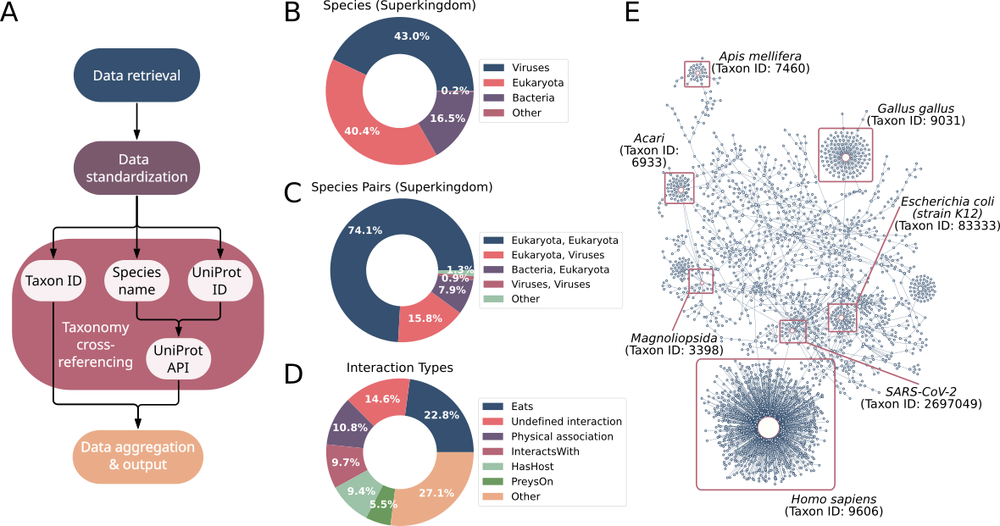

# The Interacting Species Database (ISDB)

A Comprehensive Resource for Ecological Interactions at the Molecular Level. The ISDB aggregates data on species interactions from 21 distinct sources, including protein-protein interaction, species scientific names, Taxon IDs, UniProt IDs, interaction types, ontology identifiers, references, and original database sources. ISDB is implemented using Python and Bash scripts and is freely available as open-source software under the MIT License.

<p align="center">  </p> <p align="center"><em>Figure 1. (A) Flowchart illustrating key steps in ISDB creation: data retrieval, standardization, taxonomy annotation, and aggregation. (B–D) Ring diagrams depicting (B) species distribution by superkingdom, (C) classification of interactions according to superkingdom, and (D) predominant interaction types categorized by keywords. (E) Example ecological network showing interconnected species within ISDB.</em></p>


# Web Interface
The ISDB web interface (www.elhabashylab.org/isdb) is hosted by the German Network for Bioinformatics Infrastructure (de.NBI).The interface supports batch downloads, data search, result export, and data deposition.
Manual can be found here: [ISDB Manual](https://www.elhabashylab.org/isdb/manual.html)


# How to download ISDB? 
Prebuilt versions of ISDB are available in the versions directory and can be accessed via the GitHub interface, the ISDB web interface, or directly via command line:
```
wget https://raw.githubusercontent.com/ElhabashyLab/ISDB/main/versions/ISDB_2026_05_09.<tsv/csv>.gz
```

# Building ISDB Locally

To build and run ISDB locally, follow these steps:

1. **Ensure internet connectivity**
     
   Verify that your system is connected to the internet.

2. **Clone the Repository and navigate into it**
   
   ```bash
   git clone https://github.com/ElhabashyLab/ISDB.git
   cd ISDB
   ```
   
3. **Set Up the Python Environment**

   ISDB requires Python 3.11.7 or later. If your system has a different version, we recommend creating a dedicated Conda environment

   pip:
   ```
   # Check version. Should return 3.11.7 or larger
   python3 --version
   python3 -m venv isdb_env
   source isdb_env/bin/activate
   ```

   Conda:
    ```bash
   conda create --name isdb_env python=3.11.7
   conda activate isdb_env
   ```

4. **Install Dependencies**
   
   ISDB relies on the following Python packages:
   <!-- * biopython 1.79 -->
   <!-- * click 8.1.3 -->
   <!-- * matplotlib 3.6.3 -->
   * pandas >= 2.0.3
   * numpy >= 1.24.3
   * requests
   * xmltodict >= 0.14.2
   * multipledispatch >= 0.6.0
   * xlrd
   * dotenv
     
   Install all dependencies via:
   ```
     pip install -r requirements.txt
   ```

 5. **Download Resources**

      Most databases are parsed automatically. Some must be downloaded manually from their respective websites:
      - **FGSCdb**:
           Go to (https://edelponte.shinyapps.io/FGSCdb/).
           Click Select All in each of the following filters: Species, Genotype, Host, Country, and Reference.
           Click the "Get Data" button to download the full dataset.
        
      - **EID2**:
        Click this link to download the resource directly: (https://figshare.com/ndownloader/files/2196534)

      - **DIP**:
         Go to (https://dip.doe-mbi.ucla.edu/dip/Download.cgi). Login or register. Go to "Files". Click on "SPECIES" -  - species-specific sets and download the latest full version for each species in MI TAB format. Place each file in a directory called "dip" or redefine the directory name in `main/config.env`.

      - **GMPD**:
        Go to (https://parasites.nunn-lab.org/data/).
        Download the data for primates, carnivore, and ungulate. When selecting which data fields to include, please select every option from "Hosts & Parasite Taxonomy", "Parasite Type", "Citation", and "Full Reference".
        
      - **Bat Eco-Interactions**: Go to (https://www.batbase.org/explore). Login or register. Afterwards go to "Explore" and click on the CSV icon with "CSV" label.
         
      - **BV-BRC**: Go to (https://www.bv-brc.org). Select "BACTERIA". Got to "Genomes" and lick on the "DOWNLOAD" button. Next repeat this process from the start for "ARCHAEA" and "VIRUSES". Lastly, place all files in a directory called "bvbrc" or redefine the directory name in `main/config.env`.

      - **PHILM2Web**: Go to (https://phim2web.lailab.info/pages/index.html).Note: the website is currently not available. Further instructions will be added in the future.

      - **PHISTO**: Go to (https://www.phisto.org/search.xhtml). Click on "Search"  until results appear. Click on "PHI Analysis Tool" and next on the "CSV" icon.


  6. **Configure Build Parameters**
   
     After downloading the required databases, Edit the main/config.env script to customize parameters: 

      1. **`OUT_DIRECTORY`** — Directory in which ISDB is built.  
      2. Decide which steps to (re)run
         1. **`DOWNLOAD`** — Whether to download files from scratch (`true` / `false`).  
         2. **`PROCESS`** — Whether to process downloaded files (`true` / `false`).  
         3. **`AGGREGATE`** — Whether to summon processed files (`true` / `false`).  
      3. **`OVERWRITE`** — Whether to overwrite existing stages (`true` / `false`).  
      3. **`ADDITIONAL_DATA`** — Path to additional data files or directories. Each file must include at least two species columns.
      4. **`DELETE`** — Whether to delete intermediate files after build (`true` / `false`).  
      5. **`MANUAL_DATABASES`** — Include databases that cannot be downloaded automatically  (`true` / `false`). If true, paths must be specified. 
      6. **`SOURCE_DIR`** — Directory where manual downloaded files are stored

   7. **Build the ISDB Database**
      
      From the main directory, execute
      
      ```bash
      cd main
      bash buildDB.sh
      ```
   Additional options such as overwriting existing files, retaining intermediate files, or including user-provided data can be configured within the script.

**Database Output**

The built database is available in CSV and TSV formats, with the following columns:

- `Serial Number` — Unique identifier for each interaction
- `Taxonomy ID (A/B)` — NCBI Taxonomy identifier
- `Organism (A/B)` — Scientific species name
- `UniProt ID (A/B)` — UniProt protein identifier
- `Protein Name (A/B)` — UniProt protein name
- `Interaction Type` — Description of the interaction
- `Ontology ID` — Ontology identifier for the interaction
- `Reference` — Reference as provided by the source
- `Database `— Source database of the interaction 


# How to deposite data to the ISDB?

To submit data for inclusion in our system, please contact our [team](#authors) directly. 
For local incorporation of your own data, refer to [*Building ISDB Locally*](#Building-ISDB-Locally) Building ISDB Locally instructions.

# List of resources 

The database can be built automatically. However, some resources need to be downloaded manually. This includes:
| Database | #Species | #Species Pairs | #PPIs | Interaction Type | Batch Download | Database Type | 
|----------|-----------|----------------|-------|-----------------|----------------|---------------|
| [BioGRID](https://thebiogrid.org/) | 90 | 220| 70,983 | ✔ | ✔ | M |
| [IntAct](https://www.ebi.ac.uk/intact/home) | 1,260 | 1,890 | 82,126 | ✔ | ✔ | M | 
| [MINT](https://mint.bio.uniroma2.it/) | 482 | 1,890 | 17,624 | ✔ | ✔ | M | 
| [DIP](https://dip.doe-mbi.ucla.edu/dip/Main.cgi) | 203 | 274 | 2,064 | ✔ | ✔ | M | 
| [SIGNOR](https://signor.uniroma2.it/) | 8 | 7 | 81 | ✔ | ✔ | M | 
| [VirHostNet](https://virhostnet.prabi.fr/) | 293 | 347 | 36,225 | ✔ | ✔ | HP/M |
| [PHISTO](https://www.phisto.org/) | 588 | 587 | 46,115 | ✔ | X | HP/M |
| [Interactomics](https://doi.org/10.1093/molbev/msad012) | 294 | 293 | 3,976 | ✔ | ✔ | HP/M | 
| [BV-BRC](https://www.bv-brc.org/) | 140,365 | 152,996 | 0 | X | X | HP |
| [EID2](https://eid2.liverpool.ac.uk/) | 12,559 | 18,202 | 0 | ✔ | ✔ | HP | 
| [GMPD](https://parasites.nunn-lab.org/) | 1,598 | 5,683 | 0 | X | X | HP | 
| [PHILM2web](http://philm2web.live) | 422 | 1,155 | 0 | ✔ | X | HP | 
| [PHI-base](http://www.phi-base.org/) | 614 | 1,179 | 0 | X | ✔ | HP | 
| [HPIDB](https://hpidb.igbb.msstate.edu/) | 734 | 967 | 0 | ✔ | ✔ | HP | 
| [GloBI](https://www.globalbioticinteractions.org/) | 124,879 | 684,288 | 0 | ✔ | ✔ | E | 
| [Bat Eco-Interactions](https://www.batbase.org/db) | 3,107 | 8,099 | 0 | ✔ | X | E |
| [SIAD](https://www.discoverlife.org/siad/) | 3,783 | 5,104 | 0 | ✔ | ✔ | E |
| [IWDB](https://iwdb.nceas.ucsb.edu/resources.html) | 602 | 3,533 | 0 | X | ✔ | E |
| [Web of Life database](https://www.web-of-life.es/map.php) | 172 | 1,096 | 0 | X | ✔ | E | 
| [PIDA](https://github.com/ramalok/PIDA) | 519 | 804 | 0 | X | ✔ | E | 
| [FGSCdb](https://fgsc.netlify.app/) | 19 | 15 | 0 | ✔ | X | E | 


# Cite
Mederer, M., Gautam, A., Kohlbacher, O., Lupas, A., Elhabashy, H. Interacting Species Database (ISDB): A Comprehensive Resource for Ecological Interactions at the Molecular Level. Manuscript under review.

# Authors
- Michael Mederer
- Anupam Gautam
- Hadeer Elhabashy

# Contact
If you have any questions or inquiries, please feel free to contact Hadeer Elhabashy at (Elhabashylab [@] gmail.com)

# License
- The **ISDB code** in this repository is licensed under the [MIT License](./LICENSE).
- ⭐ If this tool helped your research, please consider starring the repository.

  
Shield: [![CC BY 4.0][cc-by-shield]][cc-by]
- This **ISDB database** in the versions/ folder is licensed under a
[Creative Commons Attribution 4.0 International License][cc-by].

[![CC BY 4.0][cc-by-image]][cc-by]

[cc-by]: http://creativecommons.org/licenses/by/4.0/
[cc-by-image]: https://i.creativecommons.org/l/by/4.0/88x31.png
[cc-by-shield]: https://img.shields.io/badge/License-CC%20BY%204.0-lightgrey.svg
